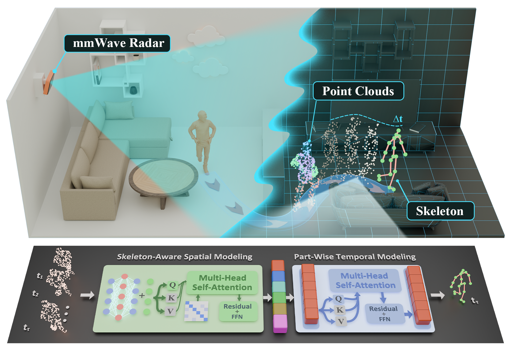

# mmWave-DensePose: mmWave Radar Dense Point Clouds for Human Pose Estimation

## Live Demo

**Project page and interactive dataset samples:**  
https://seu-rise.github.io/mmWave-DensePose/

This is the official repository for the paper:

**Human Pose Estimation of Millimeter-Wave Radar: Prototype, Dataset, and Method**

The repository will provide the code, dataset information, benchmark protocol, and pretrained resources for **mmWave-DensePose** and **PAST-Net** after cleanup and release preparation.

## Abstract

Three-dimensional human pose estimation (3D-HPE) is important for human-centered sensing, but vision-based solutions are limited by privacy concerns, illumination changes, and occlusion. Millimeter-wave (mmWave) radar provides a privacy-preserving alternative, yet existing radar point clouds are often sparse and incomplete, and existing radar 3D-HPE datasets remain limited in subject scale, frame volume, and motion diversity. This paper presents a mmWave radar prototype for dense point-cloud sensing, a large-scale mmWave radar dense HPE (mmWave-DensePose) dataset, and a Part-Aware Spatio-Temporal Network (PAST-Net) for radar-only 3D-HPE. Specifically, we design a four-chip cascaded mmWave radar system to generate dense human-related point clouds with its azimuth and elevation resolution being \(1.30^\circ\) and \(2.24^\circ\), respectively. And the constructed dataset contains 101 subjects, 19 designed motions, large amounts of free motions, and 570,124 valid synchronized frames. Each frame provides a five-dimensional radar point cloud and a 19-keypoint skeleton annotation. The proposed method uses only mmWave radar point clouds as input and Kinect V2 skeletons as ground-truth annotations. Then PAST-Net reorganizes frame-level point-cloud features into skeleton-aware part-token representations and models their temporal evolution through part-wise self-attention, assisting to compensate for weak and incomplete observations in local body regions. Experiments on the proposed benchmark show that PAST-Net achieves an average Mean Localization Error (MLE) of 4.08 cm, reducing the error by 22.14\% compared with the other state-of-the-art (SOTA) baseline. Ablation results further confirm the contributions of the proposed modules, including skeleton-aware spatial modeling, part-wise temporal modeling, and radar-specific point attributes. These results demonstrate that the designed mmWave radar prototype and the proposed method provide an effective sensing basis for privacy-preserving and fine-grained 3D-HPE.

## Repository Status

Code, dataset instructions, and pretrained resources are being prepared and will be released soon.

- [ ] Code release
- [ ] Dataset release instructions
- [ ] Training and evaluation scripts
- [ ] Pretrained checkpoints
- [ ] Data preprocessing tools
- [ ] Benchmark configuration files
- [ ] Citation file

The code and dataset will be uploaded after they are organized and reviewed.

## Overview

mmWave-DensePose is a dense millimeter-wave radar point-cloud benchmark for radar-only three-dimensional human pose estimation. The public release focuses on two main components:

1. A large-scale radar point-cloud human pose dataset.
2. PAST-Net, a Part-Aware Spatio-Temporal Network for 3D human pose estimation.

Each synchronized frame contains a 5D radar point cloud and a 19-keypoint skeleton annotation. PAST-Net uses temporal radar point-cloud windows to learn structured part-token representations and regress the target-frame 3D human pose.

## Highlights

- **Large-scale dataset**  
  101 subjects, 141 continuous sequences, and 570,124 valid synchronized frames.

- **Rich motion coverage**  
  19 predefined motions and additional free-motion sequences.

- **Radar-only 3D-HPE benchmark**  
  The model uses only mmWave radar point clouds as input. Kinect V2 skeletons are used as ground-truth annotations.

- **5D radar point representation**  
  Each radar point contains spatial coordinates, Doppler information, and signal-to-noise ratio.

- **Part-aware spatio-temporal modeling**  
  PAST-Net reorganizes frame-level radar features into skeleton-aware part-token representations and models their temporal evolution across consecutive frames.

## Dataset

The mmWave-DensePose dataset is constructed from synchronized radar and Kinect V2 recordings.

| Item | Description |
|---|---|
| Dataset name | mmWave-DensePose |
| Sensor input | Dense mmWave radar point cloud |
| Annotation source | Kinect V2 skeleton |
| Subjects | 101 |
| Motions | 19 predefined motions + free motion |
| Continuous sequences | 141 |
| Valid synchronized frames | 570,124 |
| Radar point attributes | x, y, z, Doppler, SNR |
| Skeleton annotation | 19 3D keypoints |
| Mean valid radar points per frame | 164 |

The dataset release will include the data format description, download instructions, preprocessing scripts, and benchmark split information.

## Method

PAST-Net is a **Part-Aware Spatio-Temporal Network** for dense radar point-cloud 3D human pose estimation.

The method follows a many-to-one temporal prediction setting:

1. A temporal window of radar point clouds is used as input.
2. A frame-level point-cloud encoder extracts global radar features.
3. Skeleton-aware spatial modeling converts frame features into structured part-token representations.
4. Part-wise temporal modeling captures the temporal evolution of each part token.
5. Global and part-level features are fused to regress the 19 3D keypoints of the target frame.

## Benchmark

The benchmark supports both single-frame and multi-frame radar-based 3D human pose estimation.

The current experimental setting uses:

- A five-frame temporal input window.
- The last frame as the target frame.
- Mean Localization Error (MLE) as the evaluation metric.
- Radar point clouds as the only network input.
- Kinect V2 skeletons as ground-truth annotations.

## Main Result

PAST-Net achieves the best average MLE among the reproduced and adapted baselines on the mmWave-DensePose benchmark.

| Method | Average MLE |
|---|---:|
| PAST-Net | 4.08 cm |

The full per-joint comparison and ablation results will be provided with the paper materials and evaluation scripts.

## Real-Time Application Scenario

The following real-world deployment video shows real-time pose estimation for actions and subjects that are not included in the dataset. The experiment was recorded under strong illumination conditions and runs on an entry-level NVIDIA T400 GPU.

<video src="docs/assets/video/scene.mp4" controls muted loop playsinline width="100%">
  Your browser does not support the video tag.
</video>

Video file: [docs/assets/video/scene.mp4](docs/assets/video/scene.mp4)

## License

This repository is released under the **MIT License**.

Dataset access instructions and terms for pretrained resources will be provided with the release materials.

Please do not redistribute any unreleased code, data, or checkpoint files.

## Contact

For questions about the paper, code, or dataset release, please contact the authors or open an issue after the repository is public.

Corresponding authors and contact information will be updated after publication.

## Acknowledgement

This project is based on synchronized radar point-cloud data, Kinect V2 skeleton annotation, and radar-only 3D human pose estimation. We thank the contributors and participants involved in the data collection and research development.
